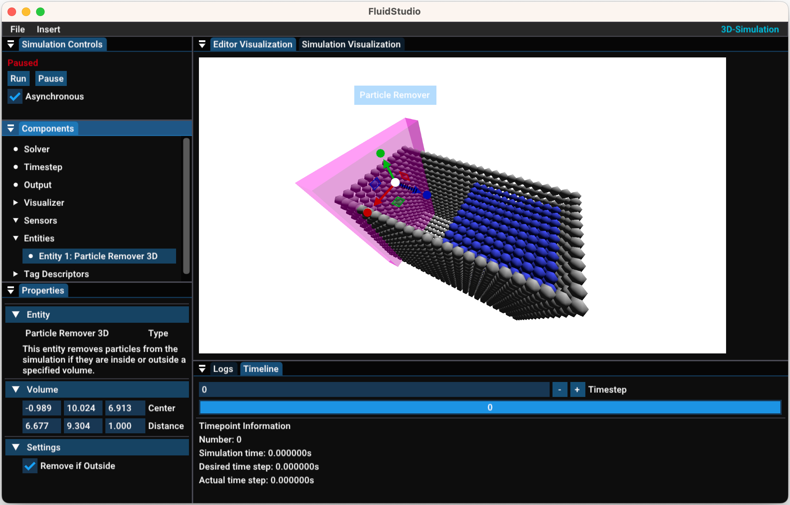

# Fluid Solver
A SPH Fluid Solver framework and studio application implemented in C++ with OpenGL visualization.
The fluid solver framework is tested with the help of googletest.
Furthermore the project contains a command line tool to calculate fluid scenarios.


<br/>*Example scenario using about 29,000 fluid particles and 59,000 boundary particles*

## About the project
This project is a work in progress. There are several things, like the code style, documentation and validation,
that I like to (and hopefully will) improve. Do not expect high-quality, well documented and thought-out code :)
The project was created during my time at university. It was used to generate data and comparisons
for my bachelor's and master's thesis, as well as for some talks and projects.

## Using the code
The whole project is cmake based and configured to run on established systems like common Linux distros, Windows machines
and OSX. The aim of the project is to run out of the box with as little work as possible.

### Dependencies
The dependencies for this project are managed with [vcpkg](https://github.com/microsoft/vcpkg) through the manifest file
`vcpkg.json`. Install vcpkg and setup the *toolchain file from vcpkg* for CMake before loading the project. If done so,
all dependencies will be downloaded automatically with vcpkg while CMake configures the project.

### Compiling
Only 64-bit compilation with the C++17 standard is supported. The project may work under other conditions but this is not tested.
Use CMake to compile the project:
- `FluidStudio` for a runnable ui executable
- `FluidConsole` for a console only application
- `libFluid` for the core fluid solver library
- `runUnitTests` to run the tests

### Used dependencies and libraries
The dependencies and libraries that are used in the project (as well as their licenses) can be found in the [THIRDPARTY.md](THIRDPARTY.md) file.

  
#### Disclaimer
The third-party libraries are not my own and i take no responsibilities for their content.
Most libraries are loaded with vcpkg. It could be possible (with a certain amount of work) to install the dependencies
manually and adapt the CMake files.

### Using the Code on Linux (Debian / Ubuntu)
The project uses OpenGL for its visualization. Therefore you have to install required
libraries in order to compile this project:
```shell script
sudo apt install mesa-utils
sudo apt install libgl1-mesa-dev
sudo apt install xorg-dev
```
*Important:* The packages could have other names for your distibution of linux. Also the
package manager (here `apt`) is not the same for every linux system.

The mesa packages are required for OpenGL support. The xorg-dev is required in order to
create a glfw_window in which OpenGL can render its stuff.
Also make sure to have a decent c++ and c compiler like a recent version of gcc available
on your system.
I recommend installing the build-essential package, since it contains the compiler and
other important stuff:
```shell script
sudo apt-get install build-essential
```
To create a CMake config you need to have CMake installed. You can obtain cmake by installing
it with your package manager. A good tool to set up the project would be VS Code
(by Microsoft) with the CMake extension (by Microsoft) and C/C++ extension (by Microsoft)
installed. VS Code requires CMake to be installed on the system. 
An alternative would be to use tools like CLion that automatically create the CMake
config for you. Clion ships with its own version of CMake but requires compilers and
libraries to be installed on the system by you.


## Gallery

<br/>*Screenshot of FluidStudio showing a small 3D breaking dam scenario and a particle remover entity* <br/><br/><br/>


https://github.com/gruco0002/FluidSolver/assets/5246006/b5bee004-8c1c-4cfb-8dd1-6a39e3a20f1e

*Showcase of a basic 2D scenario* <br/><br/><br/>


https://github.com/gruco0002/FluidSolver/assets/5246006/31920409-4575-44c9-acd1-ce4fe102a621

*Velocity field of a 3D breaking dam scenario containing 1,000,000 fluid particles*

